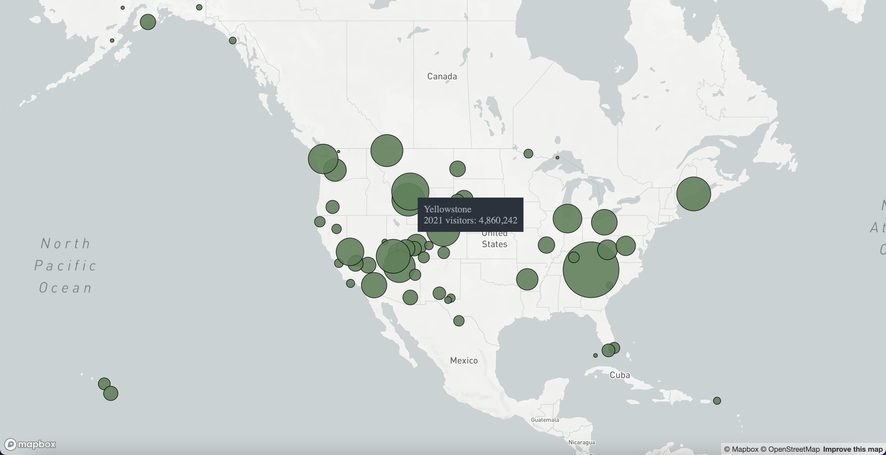

# National Parks Map

This web app displays the 63 U.S. national parks on a map. Larger circles indicate that the park had more visitors in 2021. The base map is from Mapbox and the park data is from [Wikipedia](https://en.wikipedia.org/wiki/List_of_national_parks_of_the_United_States).

## How to Run the App
Download this repository and get an API key from [Mapbox](https://www.mapbox.com/). Create a file, src/api-key.json, and add the following to its content with your own API key:\
`{"key":"API_KEY_GOES_HERE"}`

Then run in terminal:\
`npm install`\
`npm start`

## How to Run the Scraper
To avoid straining Wikipedia servers, this scraper does not make any HTTP requests. Instead, you must download the HTML file of [this Wikipedia article](https://en.wikipedia.org/wiki/List_of_national_parks_of_the_United_States) which contains a list of national parks. Then, rename it to `wikipedia-article.html` and move it to the `scrape-data` folder.

`scrape-data/extract-park-data.py` is a script which reads the content of `scrape-data/wikipedia-article.html` and extracts national park data from it to generate `src/national-parks.json`, which is read directly by the app. Since `src/national-parks.json` has already been generated, you do not need to run the scraper to run the mapping app. The article was downloaded on Decmber 10, 2022, to generate the existing data.

Install Python dependencies:\
`pip install -r scrape-data/requirements.txt`

Run the Python script to generate src/national-parks.json:\
`python scrape-data/extract-park-data.py`

## References
Setting up Deck.gl with React: https://deck.gl/docs/get-started/using-with-react

Deck.gl ScatterplotLayer documentation: https://deck.gl/docs/api-reference/layers/scatterplot-layer